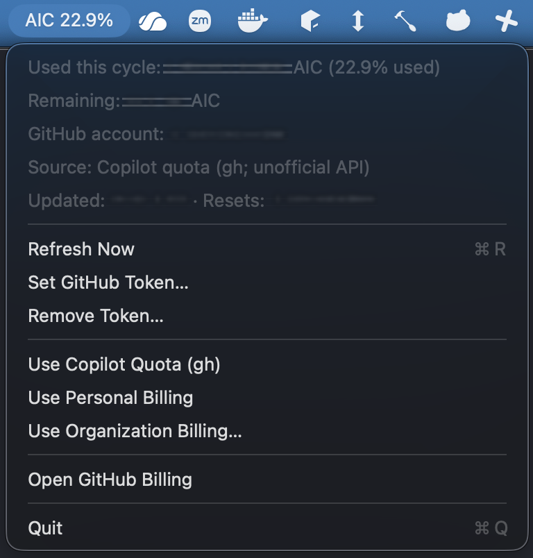

# Copilot AI credits in the macOS menu bar

A native menu-bar app showing the **percentage of Copilot AI credits used this cycle** as `AIC 22.9%`. The dropdown shows used/total and remaining credits, reset date, account, update time, and data source. It refreshes every 15 minutes, on wake, or via **Refresh Now**. macOS 13+; Apple Silicon and Intel are supported.

## Screenshots

Menu bar:


Expanded menu (credit counts, account name, and timestamps are irreversibly obscured; the percent is visible):



## Install

After this repository is published on GitHub and its first tagged release has completed, choose one of these options. Replace `OWNER/REPO` with its actual GitHub path (for example, `alice/copilot-aic-menu`).

### Homebrew

```sh
brew tap OWNER/REPO https://github.com/OWNER/REPO.git
brew install --cask OWNER/REPO/copilot-aic-menu
gh auth login
open /Applications/CopilotAICMenu.app
```

The cask installs the `gh` formula as a dependency. The release workflow adds or updates the cask in `Casks/` on the repository's default branch. `brew upgrade --cask OWNER/REPO/copilot-aic-menu` upgrades it after subsequent releases.

### Direct download

Download `CopilotAICMenu-macos-universal.zip` and `SHA256SUMS.txt` from this repository's latest **GitHub Release**. Unzip the archive, drag `CopilotAICMenu.app` into `/Applications`, then install [GitHub CLI](https://cli.github.com/) if needed and run:

```sh
gh auth login
open /Applications/CopilotAICMenu.app
```

The checksum file lets you verify the archive with `shasum -a 256 CopilotAICMenu-macos-universal.zip`. If a release is **not** Developer ID signed and notarized, macOS Gatekeeper may require you to approve it in **System Settings → Privacy & Security → Open Anyway**. This also applies to the Homebrew cask. For a frictionless download, configure the signing and notarization secrets below; a public GitHub repository and free GitHub Actions alone do not provide an Apple Developer ID.

### Build from source

With Apple's Command Line Tools installed:

```sh
./scripts/build-app.sh
open dist/CopilotAICMenu.app
```

To launch it automatically, add the installed `.app` under **System Settings → General → Login Items**. Keep the app at the same path afterward.

## How usage is calculated

The default **Copilot quota (gh)** source needs no token pasted into the app. It calculates **(entitlement − remaining) ÷ entitlement × 100**, displayed as percent **used**. It works for an organization-managed seat without organization billing-admin permissions. GitHub's `credits_used` field is **not** the current-cycle total.

**Important:** This source reads GitHub's **undocumented `/copilot_internal/user` endpoint** through your existing `gh` login. The app does not read or store the CLI's OAuth token itself, and never runs an AI prompt to check usage. The endpoint could change or stop working; on failure the menu displays an error instead of guessing a value.

### Other sources

The menu also offers documented GitHub billing report endpoints:

- **Use Personal Billing:** Requires a [fine-grained personal access token](https://github.com/settings/personal-access-tokens/new) with **User permissions → Plan → Read-only**. It only includes AI credits billed directly to a personal account, not organization/enterprise-managed usage.
- **Use Organization Billing…:** Enter the organization paying for the Copilot seat. Requires organization billing/admin access and a token with **Organization permissions → Administration → Read-only**. The report is filtered to your GitHub username. An enterprise-billed seat may require a separate enterprise billing API instead.

For these sources, use **Set GitHub Token…** and paste with ⌘V or **Paste from Clipboard**. The token is stored in macOS Keychain. **Remove Token…** deletes it. An empty report shows an explanation, not a fabricated zero. Billing-only sources have no allowance/remaining value, so they display a count rather than a percentage.

## Releasing

Once the repository has a GitHub remote and Actions are enabled, push a version tag such as `v0.1.0`. [CI](.github/workflows/ci.yml) runs offline checks and packages both architectures. The [release workflow](.github/workflows/release.yml) builds a universal `.app`, publishes a ZIP and SHA-256 file to GitHub Releases, then generates a version-and-checksum-pinned Homebrew cask and pushes it to the default branch. If that branch is protected, the release still publishes but a maintainer must commit the generated `Casks/copilot-aic-menu.rb` through a PR. Make sure Actions has permission to write repository contents.

GitHub's standard hosted Actions are generally free for public repositories; the MIT license itself does not determine Actions billing. For a notarized release, configure these GitHub Actions secrets from a paid Apple Developer account:

| Secret | Purpose |
| --- | --- |
| `MACOS_CERTIFICATE_P12` | Base64-encoded Developer ID Application `.p12` certificate |
| `MACOS_CERTIFICATE_PASSWORD` | Password for that `.p12` |
| `MACOS_CODESIGN_IDENTITY` | Full `Developer ID Application: ... (TEAMID)` identity |
| `APPLE_ID` | Apple ID used for notarization |
| `APPLE_APP_SPECIFIC_PASSWORD` | App-specific password for that Apple ID |
| `APPLE_TEAM_ID` | Apple Developer team ID |

Without those secrets, the workflow still publishes an **ad-hoc-signed, unnotarized** app. To test packaging locally, run `UNIVERSAL=1 ./scripts/build-app.sh && ./scripts/package-release.sh`. Run offline checks with `swift run AICCoreChecks`, or check the live quota with `swift run AICCoreChecks --live`.

The raw screenshots in the project root are ignored by Git. To regenerate the publishable copies under `docs/images/`, install Pillow and run `python3 scripts/redact-screenshots.py`; inspect the output before committing if screenshots change.

Licensed under the [MIT License](LICENSE).
